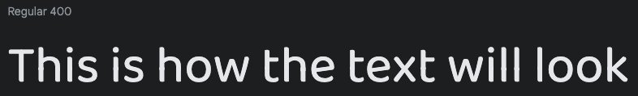
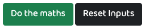

# **Simple JavaScript Tip Calculator**

## **Introduction**

A little mini JavaScript project that allows users to work out the cost of a bill, a tip if one was given, and to see how much each person should pay.  

## **Table of contents** 

### **1. User Experience (UX)**
  * 1.1 Target audience
  * 1.2 Visitor goals
  * 1.3 Business goals
  * 1.4 User stories
  * 1.5 Design choices
  * 1.6 Wire frames

### **2. Features**
  * 2.1 The Navbar
  * 2.2 User Inputs
  * 2.3 Action Buttons
  * 2.4 Bill Breakdown
  * 2.5 Footer
  * 2.6 Features Left To Implement

### **3. Technologies/Languages Used**
  * 3.1 VSCode
  * 3.2 HTML5
  * 3.3 CSS
  * 3.4 JavaScript
  * 3.5 Bootstrap
  * 3.6 Google fonts 
  * 3.7 Icons8
  * 3.8 Balsamiq
  * 3.9 Animate.css

### **4. Testing**
  * 4.1 See [testing.md](testing.md) document 

### **5. Deployment**

  * 5.1 Deployment 
  * 5.2 Cloning 
  * 5.3 Cloning Desktop

### **6. Credits**
  * 6.1 Media
  * 6.2 Code
  * 6.3 Acknowledgements

### **7. Contact**
  * 7.1 LinkedIn
  * 7.2 Email
  * 7.3 Skype

### **8. Disclaimer**

  * 8.1 Disclaimer on project 

## **1. User Experience (UX)**

### **1.1 Target Audience**

* This website is aimed at anyone who wants to workout how much their bill, tip and breakdown per person will be. Initially aimed at bar and restaurant bills but if you find another use for it thats great.

### **1.2 Visitor goals** 

* I want to be able to workout how much a percentage tip will be in currency value and also the breakdown per person owed.

### **1.3 Business goals**

* No business or monetary goals, just a user friendly tool that lets users workout and breakdown their bills in a few clicks.

### **1.4 User Stories**

* As a visitor to the company website i expect/want/need
 

### **1.5 Design choices** 

* I kept this project nice and simple, to give it a more pleasing aesthetic i added some animated icons and a little bit of colour ot the input and output fields. The project is a simple tip calculator so no need to over complicate it. 

#### **FONTS**

* I decided i would use the Google fonts [Baloo Bhaijaan 2](https://fonts.google.com/specimen/Baloo+Bhaijaan+2?query=baloo#about) Baloo Bhaijaan 2 is a perfect blend of pointy paws in a coat of fur, Baloo is an affable display typeface by Ek Type. Available in nine Indian scripts plus Arabic along with a Latin counterpart, the family is Unicode compliant and libre licensed.

#### **ICONS**

* I decided i would use [Icons8](https://icons8.com/) icons for the project. Icons8 has a wide range of colorful and animated icons that are free to use. 

#### **COLOURS**

* The main colour pallet for the project can be found below. 

* I kept the colour palette simple, a white background with black text. The icons are all cartoon type and coloured. The user inputs have been coloured in a beige colour and the output fields have been coloured in grey so they user can see at a glance these are not adjustable. The action button to calculate the bill is the  standard bootstrap success green. The reset calculator button is plain black. 

### **1.6 Wire Frames** 

* The wireframes for the project can be seen below. There is a wireframe for desktop, tablet and mobile.

#### **DESKTOP**

#### **TABLET**

#### **MOBILE**

## **2. Features**

### **2.1 The Navbar**

* The Navbar is a very basic bootstrap Navbar that just holds the tip logo and the name of the site which is Tip Calculator. On mobile devices the logo and the site name will always stay centered. As the site is just a single page there is no need for a mobile hamburger menu

### **2.2 User Inputs** 

* The user only has 3x inputs to work with. Total bill, Tip percentage they wish to leave, and the number of people who will split the bill. All of the input fields are number only fields to stop users inputting letters in. The number of people field also only accepts whole numbers so users cant input a decimal field and input something like 2.5 people will split the bill. 

### **2.3 Action Buttons**

* There are 2 buttons for the user to interact with. The first one will trigger the calculation once the user has added all of the inputs into the input field. The second button will reset the calculator incase the user wishes to start all over again.

* Note: The user doesn't have to reset the entire calculator if they wish to change something after a breakdown has been given. If they wish to change something they can just adjust one single field and press the Do the maths button and the calculation will run again. 

### **2.4 Bill Breakdown**

* The bill breakdown section lets the user know the total bill amount (Including tip), the value of the tip, and finally how much each person owes. These input fields have been disabled so users are unable to alter or adjust the information that gets displayed.   

### **2.5 Footer**

* The footer contains the basic information on the site and the copyright.

### **2.6 Features Left To Implement**

* I may add an ability for users to look at splitting the bill as a percentage as well as having the option to split it evenly. With this feature a user could say person 1 will pay 30% of the bill, person 2 will pay 20% of the bill, and person 3 will pay 50% of the bill.

* Also when people go for dinner it is not uncommon for people who are drinking alcohol to separate their bill from the food, so i may add a feature where people can add the food and the drink separate. 

## **3. Technologies/Languages Used**

3.1 [VSCode](https://code.visualstudio.com/) - Is the IDE i used for this project 
3.2 [HTML5 - Hypertext Markup Language](https://html.com/html5/#What_is_HTML) - This is the markup language i used for this project. 
3.3 [CSS - Cascading Style Sheet](https://en.wikipedia.org/wiki/CSS) - I used CSS to help alter and adjust the presentation of the website to create a pleasant user experience. 
3.4 [JavaScript](https://en.wikipedia.org/wiki/JavaScript) - JavaScript was used to do the mathematics to give the user the full breakdown 
3.5 [Bootstrap](https://getbootstrap.com/) - Bootstrap is the most popular CSS Framework for developing responsive and mobile-first websites. Bootstrap 5 is the version i used for the development of this project. 
3.6 [Google fonts](https://fonts.google.com/) - Launched in 2010 Google Fonts is a library of 1,023 free licensed font families. 
3.7 [Icons8](https://icons8.com/) - You can see a short YouTube video about Icons8 by clicking [Here](https://www.youtube.com/watch?v=C4TcBmdaa-Q&t=40s). 
3.8 [Balsamiq](https://balsamiq.com/)- Balsamiq Wireframes is a rapid low-fidelity UI wireframing tool that reproduces the experience of sketching on a notepad or whiteboard.
3.9 [Animate.css](https://animate.style/) - Animate.css is a library of ready-to-use, cross-browser animations for use in your web projects. Great for emphasis, home pages, sliders, and attention-guiding hints.

## **4. Testing**

* Testing information can be found in the [testing.md](testing.md) file

## **5. Deployment**

### **5.1 Deployment**  

To deploy the site on Github i undertook the following steps:

1. Navigated to my profile page on Github
2. Selected this project from the repositories
3. Clicked on settings
4. Scroll down to the Github pages section 
5. Click where is says source and in the dropdown menu select master 
6. Click on the next dropdown menu to the right select /(root)
7. Click save

You will then receive a confirmation saying the page has been published and also be provided with the link where people can view your site.

The link to view the live site can be found by clicking [Here](https://smcgdub.github.io/JS-Tip-Calculator/)

### **5.2 Cloning**

You can clone the projects repository to your local computer by following the steps below:

Cloning a repository using the command line

1. On github navigate to the project repository. The link can be found here: https://github.com/smcgdub/JS-Tip-Calculator
2. Click on the tab that says < >code 
3. Above the files, click the button that says &#8595;code

4. From the menu select HTTPS
5. Click on the clipboard icon on the right hand side (Image below)

6. Open the terminal in your IDE
7. Change the current working directory to the location where you want the cloned directory.
8. In terminal type `git clone` and then paste the URL you copied earlier 
9. Press Enter to create your local clone.

### **5.3 Cloning Desktop**
You can also clone the project using Github Desktop. To do this you can do the following: 

1. Download Github Desktop if you do not already have it installed. The link can be found here [Github Desktop](https://desktop.github.com/)
2. Sign in to GitHub and GitHub Desktop before you start to clone.
3. On github navigate to the project repository. The link can be found here: https://github.com/smcgdub/JS-Tip-Calculator-
4. Click on the tab that says < >code 
5. Above the files, click the button that says &#8595;code

6. Click open with GitHub Desktop to clone and open the repository with GitHub Desktop.
7. Click Choose... and, using the Finder window, navigate to a local path where you want to clone the repository.
8. Click clone 

## **6. Credits** 

### **6.1 Media** 

 * All of the icons i used for the project were from Icons8. All credit for these icons goes to [Icons8](https://icons8.com/)

### **6.2 Code** 

### **6.3 Acknowledgements**

## **7. Contact**

Feel free to contact me on any of the following channels: 

* 7.1 [LinkedIn](https://www.linkedin.com/in/stephenmcgovern01/) 
* 7.2 [Email](mailto:stephen_xyz1@hotmail.com) 
* 7.3 [Skype](live:.cid.c60777f26a9655f2)

## **8. Contact**

* 8.1  This website and all of its content is for educational purposes only. There is no monetization generated from this site.

