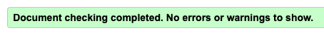
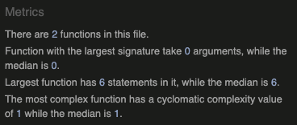

d# **Simple JavaScript Tip Calculator Testing**

>
## **Table of contents** ##

### **1. Automated Testing** ###

* 1.1 HTML Code Validating 
* 1.2 CSS Code Validating 
* 1.3 JavaScript Validating 

### **2. Manual Testing** ###

* 2.1 Manual testing desktop
* 2.2 Manual testing mobile

### **3. JavaScript Console Testing** ###

* 3.1 Test results from the console

<strong>1. Automated Testing</strong>

 

**1.1 HTML Code Validating**

* All of the HTML files were tested on the [W3C HTML Markup Validation website](https://validator.w3.org/)
* All of the files came back clear with the result of **"Document checking completed. No errors or warnings to show"**

**1.2 CSS Code Validating**

* The main CSS files were tested on the [W3C CSS  Validation website](https://jigsaw.w3.org/css-validator/) 
* All of the files came back clear with the result of **"Congratulations! No Error Found."**

**1.3 JavaScript Code Validating**
* The main JavaScript file was tested on the [JSHint website](https://jshint.com/) 
* All of the files came back clear with no errors. The report can be found below:

* JSHint did state that the below variable is unused

* however this isn't correct that that variable is used in the line of code  

`let uiEachPersonPays = document.getElementById('each_person_pays_display').value = parseFloat(uiBillTotalDisplay / uiNumberOfPeopleInput).toFixed(2);
`

<strong>2. Manual Testing</strong>

 

#### **2.1 Manual testing desktop**

* All desktop testing was carried out on Chrome, FireFox, Safari and Opera. 

**i. Navbar**

* The Navbar is functioning as normal with no issues

**ii. User Inputs**

* The User Inputs are functioning as normal with no issues

**iii. Action Buttons**

* The Action Buttons are functioning as normal with no issues

**iv. Bill Breakdown**

* The Action Buttons are functioning as normal with no issues

**v. Footer**

* The footer is static and has no functioning parts. It is being displayed as normal.

#### **2.2 Manual testing mobile**

* All mobile testing was carried out on tablet and mobile phones using Chrome, FireFox and Opera. To save repetition, unless there has been an issue highlighted below, then the site has functionality is normal. 

**i. Navbar** 
**ii. User Inputs** 
**iii. Action Buttons** 
**iv. Bill Breakdown** 
**v. Footer** 

<strong>3. JavaScript Console Testing</strong>

 

#### **3.1 Console Testing**

* There are no errors displaying when the console testing was carried out

