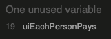

# **Simple JavaScript Tip Calculator Testing**

>
## **Table of contents** ##

### **1. Automated Testing** ###

* 1.1 HTML Code Validating 
* 1.2 CSS Code Validating 
* 1.3 JavaScript Validating 

### **2. Manual Testing** ###

* 2.1 Manual testing desktop
* 2.2 Manual testing mobile

### **3. JavaScript Specific Testing** ###

* This section is the most detailed and contains all the information from all of the testing of each Javascript file.

<strong>1. Automated Testing</strong>

 

**1.1 HTML Code Validating**

* All of the HTML files were tested on the [W3C HTML Markup Validation website](https://validator.w3.org/)
* All of the files came back clear with the result of **"Document checking completed. No errors or warnings to show"**

**1.2 CSS Code Validating**

* The main CSS files were tested on the [W3C CSS  Validation website](https://jigsaw.w3.org/css-validator/) 
* All of the files came back clear with the result of **"Congratulations! No Error Found."**

**1.3 JavaScript Code Validating**
* The main JavaScript file was tested on the [JSHint website](https://jshint.com/) 
* All of the files came back clear with no errors. The report can be found below:

* JSHint did state that the below variable is unused

* however this isn't correct that that variable is used in the line of code  

`let uiEachPersonPays = document.getElementById('each_person_pays_display').value = parseFloat(uiBillTotalDisplay / uiNumberOfPeopleInput).toFixed(2);
`

<strong>2. Manual Testing</strong>

 

**2.1 Manual testing desktop**

All desktop testing was carried out on Chrome, FireFox and Safari. 

**1. Navbar**

**2. User Inputs**

**3. Action Buttons**

**4. Bill Breakdown**

**5. Footer**

<strong>2.1 Manual testing mobile</strong>

 

**1. Navbar**

**2. User Inputs**

**3. Action Buttons**

**4. Bill Breakdown**

**5. Footer**

<strong>3. JavaScript Specific Testing</strong>

There is only 1 single JavaScript file in the project which is the app.js file

**TESTING OF THE APP.JS FILE**

The testing for the app.js file was carried out on [JShint.com](https://jshint.com/) The results from the test were as follows:

### **D) Console Testing** ###

